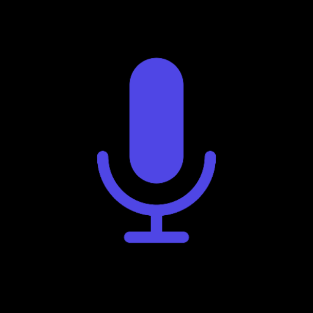
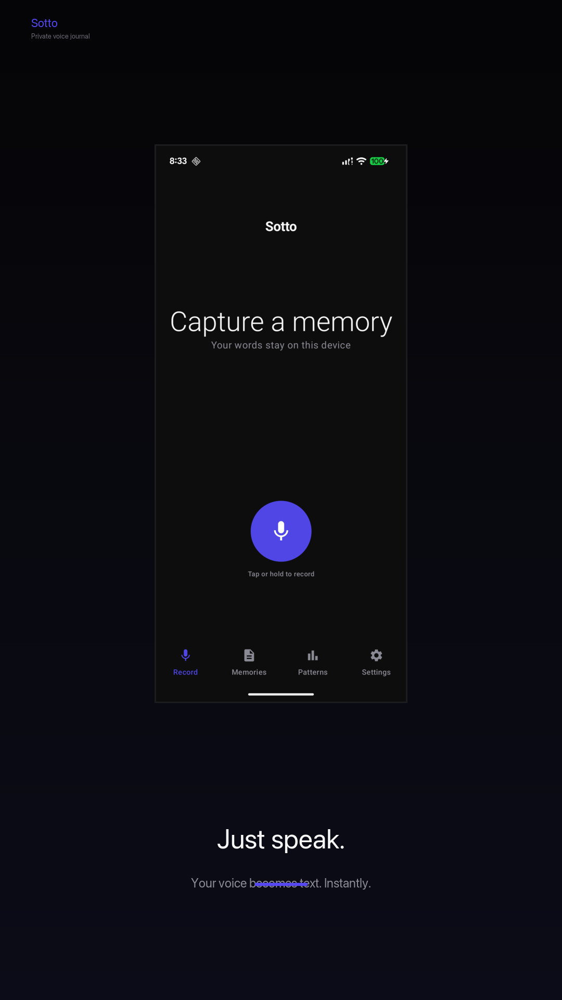
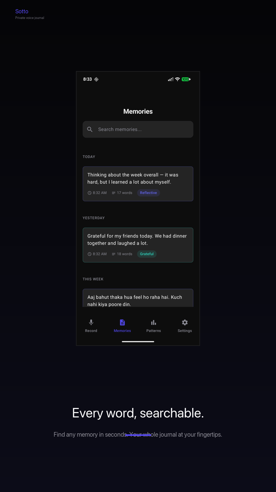
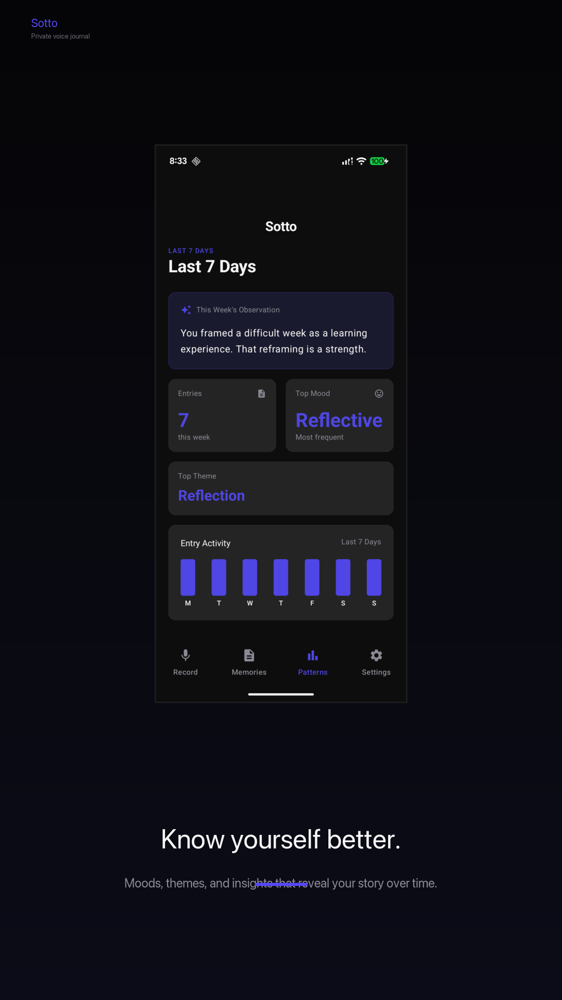
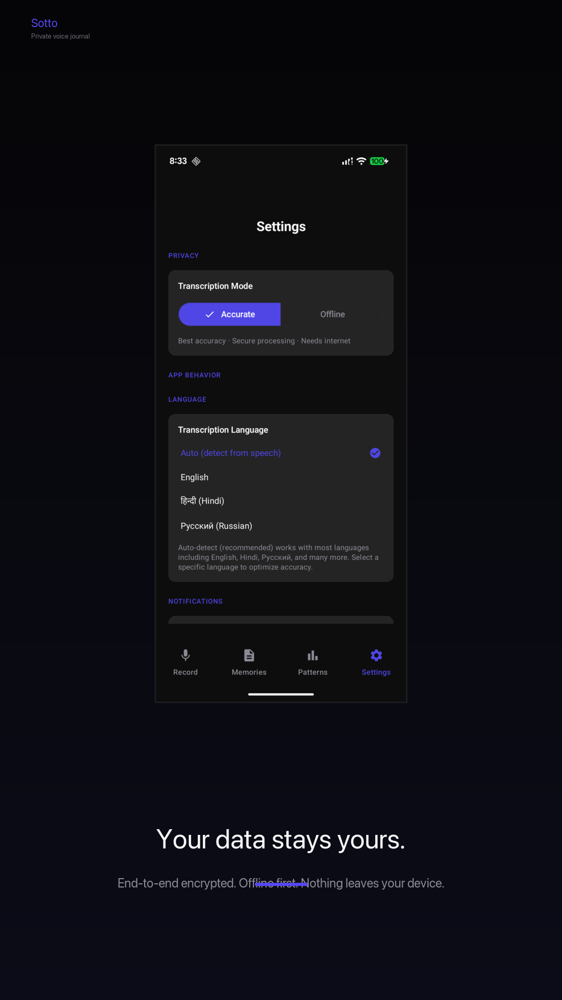

````md
# Sotto | Private Voice Memory App for Android

> *Sotto Voce: to speak quietly, under your breath.*

<p align="center">
  
</p>

<h3 align="center">Capture ideas, conversations, and moments by speaking.</h3>

<p align="center">
Private. Encrypted. Searchable. Offline first.
</p>

<p align="center">
  <a href="https://play.google.com/store/apps/details?id=com.sotto.memories">
    
  </a>
  
  
  
</p>

<p align="center">
  <a href="https://www.producthunt.com/products/sotto-5">
    
  </a>
  &nbsp;
  <a href="https://open-launch.com/projects/sotto">
    
  </a>
  &nbsp;
  <a href="https://www.shipit.buzz/products/sotto?ref=badge">
    
  </a>
</p>

---

Sotto is a private voice memory app for Android that helps you preserve ideas, conversations, lessons, book recommendations, and everyday moments before they are forgotten.

Simply press record and speak naturally. Sotto transcribes your voice, organizes your memories with AI, and stores everything securely on your device.

No ads. No tracking. No login. Just your memories.

---

## Screenshots

<p align="center">
  
  
</p>

<p align="center">
  
  
</p>
 

---

## Download

<a href="https://play.google.com/store/apps/details?id=com.sotto.memories">
  
</a>

---

## Why Sotto Exists

Most people don't forget because they have bad memories.

They forget because life moves fast.

Ideas during walks. Recommendations from friends. Lessons learned. Small moments that matter.

The problem isn't that these things aren't important. It's that capturing them usually requires stopping what you're doing and typing everything out.

Sotto removes that friction.

Press record. Speak naturally. Done.

---

## Features

- 🎙 Voice first memory capture
- 🤖 AI generated titles, tags, mood, categories, and reflections
- 🔍 Full text search across every memory
- 🔒 SQLCipher encrypted local storage
- 📴 Fully offline transcription with Vosk
- 🎯 Accurate transcription with Groq Whisper Zero Data Retention
- 📊 Mood trends and memory insights
- ⭐ Star important memories
- 🌐 English and Hindi support
- 🔄 Background processing with WorkManager
- 🚫 No ads
- 🚫 No tracking
- 🚫 No login required

---

## Privacy

Your memories belong to you.

- Everything is stored locally.
- SQLCipher encrypts your database.
- Offline transcription is available.
- Accurate mode uses Groq Zero Data Retention.
- No advertising.
- No analytics.
- No tracking.
- No selling your data.

You stay in control of your memories.

---

## Tech Stack

| Layer | Technology |
| ------ | ---------- |
| Language | Kotlin Multiplatform |
| UI | Jetpack Compose |
| Navigation | Voyager |
| Database | SQLDelight + SQLCipher |
| Networking | Ktor |
| Dependency Injection | Koin |
| Background Jobs | WorkManager |
| Cloud Transcription | Groq Whisper |
| AI Memory Organization | Groq Llama |
| Offline Speech Recognition | Vosk |
| API Proxy | Cloudflare Workers |

---

## Architecture

```text
Record Audio
      ↓
Temporary Audio
      ↓
Background WorkManager Job
      ↓
Whisper Transcription
      ↓
AI Memory Organization
      ↓
Encrypted Memory Storage
      ↓
Temporary Audio Deleted
      ↓
Memory Timeline
````

Offline first.

Privacy first.

Clean Architecture.

```
Presentation
      ↓
Domain
      ↓
Data
```

---

## Roadmap

* [ ] On This Day
* [ ] Semantic memory search
* [ ] Life chapter clustering
* [ ] Gujarati support
* [ ] iOS app
* [ ] Optional encrypted cloud backup

---

## Built With

Sotto is powered by some incredible technologies.

* Groq
* Vosk
* SQLCipher
* Kotlin Multiplatform
* Jetpack Compose
* SQLDelight
* Ktor
* Koin
* WorkManager

---

## Legal

* Privacy Policy
* Terms of Service

These documents apply to the Sotto Android application available on Google Play.

---

## Contact

Built by **The Solitary Dev**

📧 [sottoapp.help@gmail.com](mailto:sottoapp.help@gmail.com)

Google Play:
https://play.google.com/store/apps/details?id=com.sotto.memories

---

*"Speak now. Remember later."*

```
```
